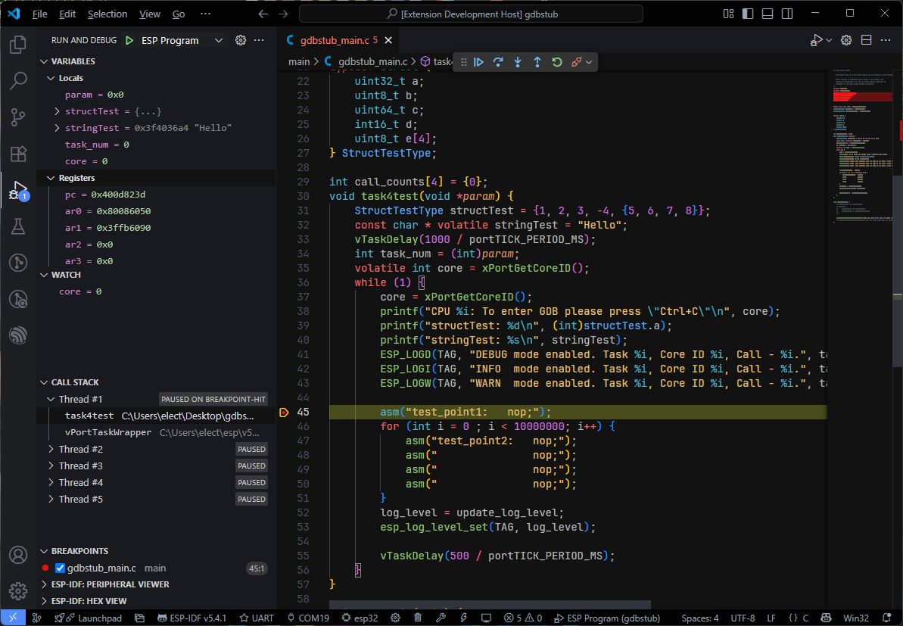

# ESP Debug

ESP Debug is a Visual Studio Code extension designed to support ESP32 debugging over COM port using ESP-IDF's built-in GDB Stub.



---

## Key Features

- **Works with ESP-IDF's built-in GDB Stub**.
- **COM Port Communication**: Just connect the built-in COM port on ESP32 board to debug.
- **Basic debugging features**:
  - Pause, Continue, Stop, Restart, Step Over, Step Into, Step Out.
  - Stack trace for each thread.
  - Set and remove breakpoints.
  - View local variables, CPU registers and evaluate expressions.
  - Show messages logged from target.

---

## Installation & Usage

1. **Installing the extension**

    - Install [ESP Debug Extension](https://marketplace.visualstudio.com/items?itemName=ElectricThanhTung.esp-debug) on Visual Studio Code.
    - Click on the "**Install**" button.

2. **Prerequisites**

    - Make sure to use ESP-IDF and have GDB Stub enabled:
      - Component Config -> GDB Stub -> GDBStub on runtime.
    - Build and flash your code to the board.

3. **Configuration**

    - In Visual Studio Code, go to `Run > Add Configuration... > ESP Debug` to add ***launch.json*** with default configuration. Or you can create it manually with the following content:
      ```json
      {
          "version": "0.2.0",
          "configurations": [
              {
                  "type": "esp-debug",
                  "request": "launch",
                  "name": "ESP Program",
                  "program": "build/your_app.elf",
                  "port": "COMx"
              }
          ]
      }
      ```
    - Change the default properties in ***launch.json*** to match your project.
    <br>
    <br>

    >**NOTE**: If you want to synchronize the selected COM port with ESP-IDF extension you can do as following example:
    >```json
    >"port": "${config:idf.portWin}"
    >```

4. **Start debugging**

    - Press F5 and now you can start debugging your project.
    <br>
    <br>

    >**NOTE**: This extension does not support flashing your code to the board yet. So make sure you flash it before you start debugging.

---

## Contributing

Contributions are welcome! Feel free to open issues or submit pull requests to improve this extension.

---

## License

ESP-Debug is licensed under the [MIT License](LICENSE.txt).